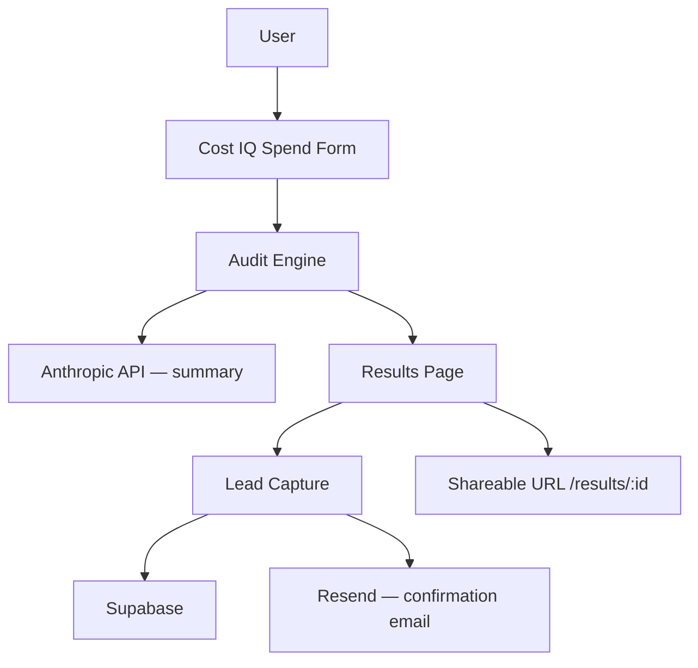

# Architecture — Cost IQ

## System Diagram

## Data Flow
[Fill in: how a user's input becomes an audit result]

## Stack Choice
[Fill in: why Next.js, Tailwind, Supabase, etc.]

## Scaling to 10k audits/day
[Fill in]
