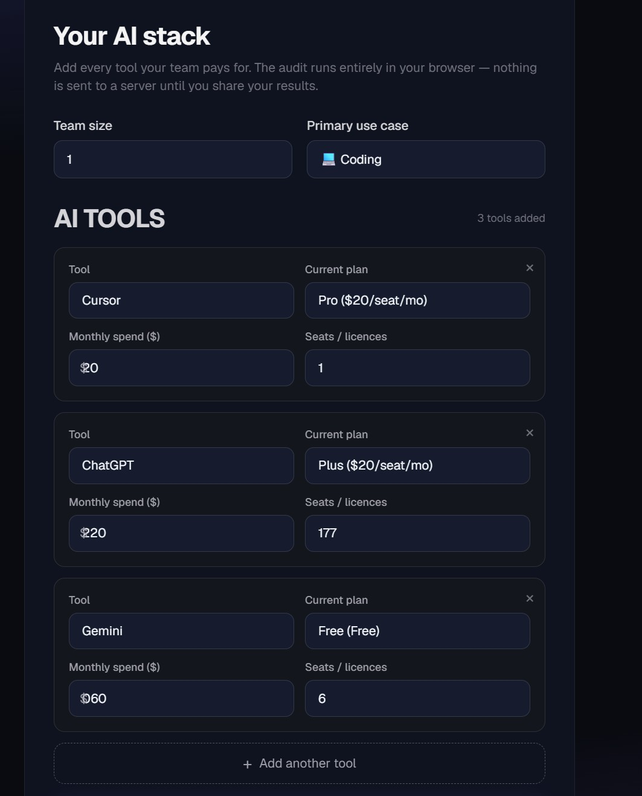
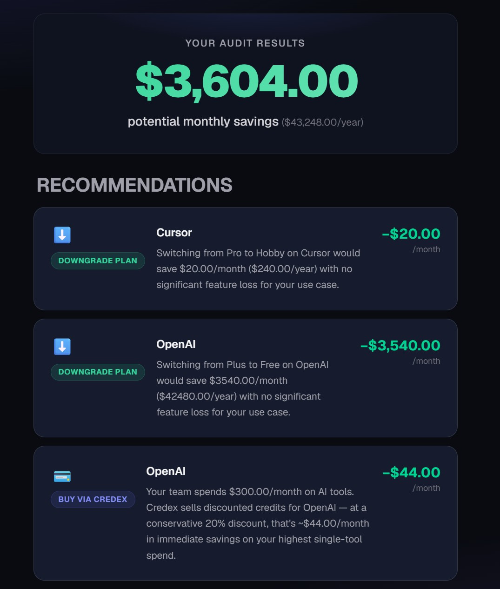
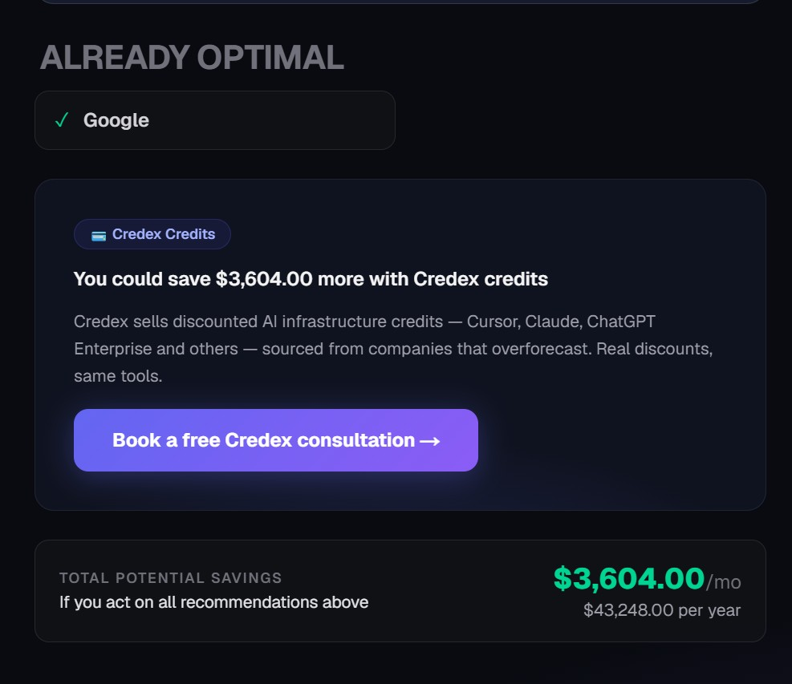

# Cost IQ

Cost IQ is a free AI spend auditor for startup founders and engineering managers. Input the AI tools your team pays for and get an instant breakdown of where you're overspending, what to switch or downgrade, and exactly how much you could save — monthly and annually.

Built as part of the Credex Web Development Intern application.

## Live URL

https://cost-iq-lovat.vercel.app/

## Screenshots

### Spend input form with multiple tools added



### Audit results with per-tool breakdown and savings hero




### Shareable result page at /results/:id


## Quick start

```bash
git clone https://github.com/harshitak13/cost-iq.git
cd cost-iq
npm install
cp .env.example .env.local
# Fill in .env.local with your keys (see Environment Variables)
npm run dev
```

Open http://localhost:3000

## Environment variables

| Variable                    | Where to get it                                             |
| --------------------------- | ----------------------------------------------------------- |
| `ANTHROPIC_API_KEY`         | [console.anthropic.com](https://console.anthropic.com)      |
| `NEXT_PUBLIC_SUPABASE_URL`  | Supabase project settings → API                             |
| `SUPABASE_SERVICE_ROLE_KEY` | Supabase project settings → API (service_role)              |
| `RESEND_API_KEY`            | [resend.com/api-keys](https://resend.com/api-keys)          |
| `NEXT_PUBLIC_BASE_URL`      | Your deployed URL (e.g. `https://cost-iq-lovat.vercel.app`) |

## Run tests

```bash
npm run test
```

7 tests covering the audit engine: seat-count guard, downgrade math, annual savings calculation, tool-switch noise suppression, credits CTA threshold, already-optimal path, and empty input handling. See [TESTS.md](./TESTS.md) for the full test table.

## Deploy

Deployed on Vercel. To deploy your own:

1. Push repo to GitHub
2. Import into Vercel
3. Add all environment variables from the table above
4. Deploy

## Decisions

1. **Client-side audit engine** — `runAudit()` runs entirely in the browser. No server round-trip needed for the core logic, which means instant results and no API cost per audit. The Anthropic summary is the only network call on the results page.

2. **Email captured after value, never before** — the audit runs and results display in full before any email is asked for. This follows the brief's explicit requirement and reduces abandonment at the most important step. User Interview #2 (Priya) confirmed this: "I would never give my email before seeing if the tool actually found anything useful."

3. **In-memory rate limiting over Redis** — chosen for MVP speed. Resets on server restart, sufficient for low traffic. Documented in `/api/lead/route.ts` with the production alternative (Upstash Redis sliding window). At 10k audits/day this would need to be replaced — see ARCHITECTURE.md scaling section.

4. **Honeypot over hCaptcha** — hCaptcha adds a user-facing friction step and a JS bundle. A hidden field honeypot catches the majority of automated submissions with zero user impact. Sufficient for MVP volume.

5. **Hardcoded audit rules over AI-generated recommendations** — the brief explicitly flags this. Audit math uses typed constants from `pricingData.ts`. AI is used only for the summary paragraph where natural language adds value. A finance person can read and verify every rule in `auditEngine.ts`.
